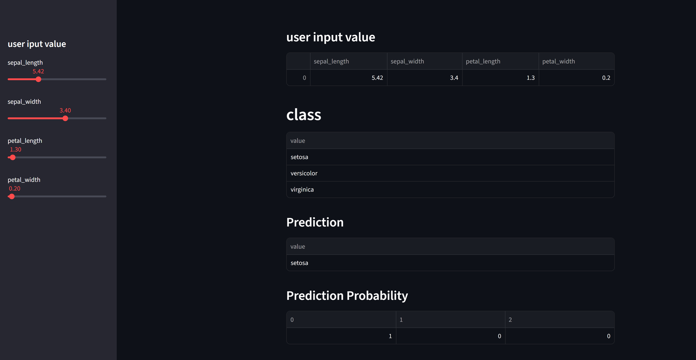

# 🚀 Interactive Iris Flower Classification Web App

This project demonstrates the deployment of a machine learning model as an interactive web application using Streamlit. The app allows users to input the physical measurements of an Iris flower and instantly receive a prediction of its species, showcasing a practical end-to-end data science workflow from model training to deployment.

## 🎯 Problem Statement and Goal of Project

The primary goal of this project was to bridge the gap between a trained machine learning model and a usable, interactive product. I aimed to create a tool that would allow anyone, regardless of their technical background, to interact with a classification model in real-time. This project serves to demonstrate my skills in model deployment, front-end application development with Streamlit, and creating practical, data-driven solutions.

-----

## 💡 Solution Approach

To achieve this, I developed a simple yet effective solution:

1.  **Model Training:** A **Random Forest Classifier** was trained on the classic Iris dataset. The model learns the relationships between the flower's sepal and petal measurements to distinguish between the three species.
2.  **Web Interface:** The **Streamlit** framework was used to construct the front-end interface. I designed a clean layout with a sidebar containing interactive sliders for a seamless user experience.
3.  **Real-Time Prediction:** Users can adjust the sliders to input the sepal length, sepal width, petal length, and petal width. The application captures these inputs, feeds them directly into the trained model, and displays the predicted Iris species and the corresponding confidence probabilities on the main screen instantly.

-----

## 🛠️ Technologies & Libraries

  * **Python**: The core programming language.
  * **Streamlit**: For building and deploying the interactive web application.
  * **Scikit-learn**: For implementing the Random Forest model and accessing the dataset.
  * **Pandas**: For structuring the user input into a DataFrame for the model.
  * **NumPy**: For numerical operations.
  * **Conda**: For environment and package management.

-----

## 📊 Description about Dataset

This application utilizes the classic **Iris flower dataset**, which is included in the `scikit-learn` library. This dataset is a collection of 150 samples from three species of Iris flowers: **Setosa**, **Versicolor**, and **Virginica**. Each sample is described by four features:

  * Sepal Length (cm)
  * Sepal Width (cm)
  * Petal Length (cm)
  * Petal Width (cm)

-----

## ⚙️ Installation & Execution Guide

To run this application on your local machine, please ensure you have Anaconda or Miniconda installed. Then, follow these steps:

1.  **Clone the repository:**
    ```bash
    git clone <repository-url>
    ```
2.  **Create and activate the Conda environment:**
    The included `streamlit_env.yml` file contains all the necessary dependencies.
    ```bash
    conda env create -f streamlit_env.yml
    conda activate streamlit-ml
    ```
3.  **Run the Streamlit application:**
    Open your terminal, navigate to the project directory, and execute the following command:
    ```bash
    streamlit run "web app streamlit.py"
    ```
    The application will open in a new tab in your web browser.

-----

## 📈 Key Results / Performance

The focus of this project is on the successful deployment and interactivity of the web application rather than on achieving state-of-the-art model accuracy. The Random Forest model is trained on the full dataset to provide a functional predictive tool for demonstration purposes. The key result is a fully operational web app that accurately reflects the model's predictions in real-time based on user-provided data.

-----

## 🖼️ Screenshots / Sample Output

Here is a screenshot of the running application, showcasing its clean and intuitive user interface.

-----

## 🧠 Additional Learnings / Reflections

During the development of this project, I explored several other features of the Streamlit library beyond what is in the final version. The commented-out code in the script and unused project files show my experimentation with:

  * Loading and displaying external datasets with `st.dataframe` (using the `googleplaystore.csv` file).
  * Rendering images within the application (`st.image`).
  * Implementing user-friendly status indicators like progress bars (`st.progress`) and spinners (`st.spinner`).

This exploration gave me a deeper understanding of Streamlit's capabilities for creating rich, interactive, and user-centric data applications, demonstrating my commitment to learning and mastering new tools.

-----

## 👤 Author

## Mehran Asgari

## **Email:** [imehranasgari@gmail.com](mailto:imehranasgari@gmail.com)

## **GitHub:** [https://github.com/imehranasgari](https://github.com/imehranasgari)

-----

## 📄 License

This project is licensed under the Apache 2.0 License – see the `LICENSE` file for details.

💡 *Some interactive outputs (e.g., plots, widgets) may not display correctly on GitHub. If so, please view this notebook via [nbviewer.org](https://nbviewer.org) for full rendering.*